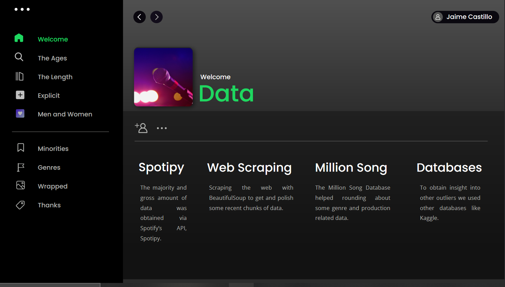
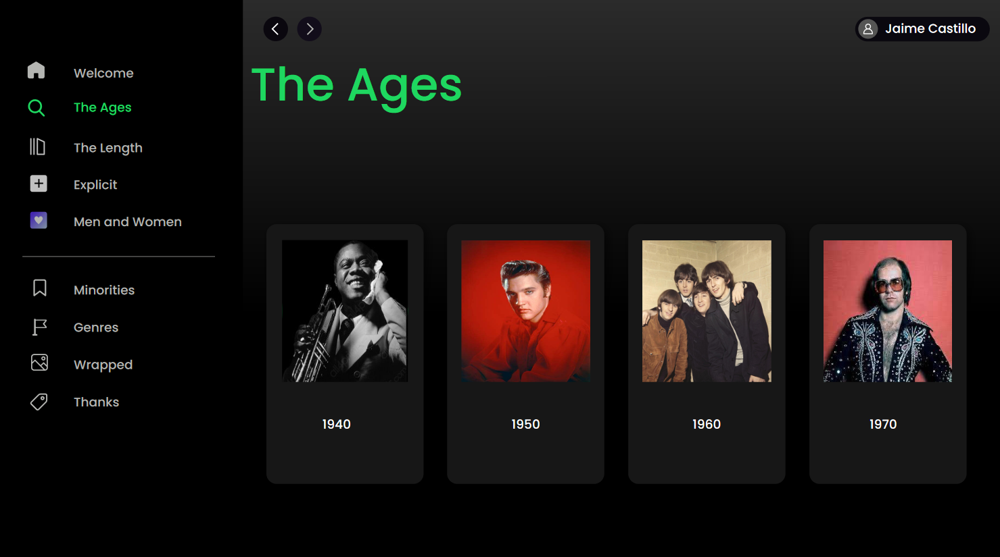
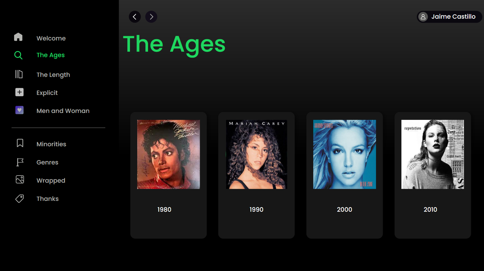
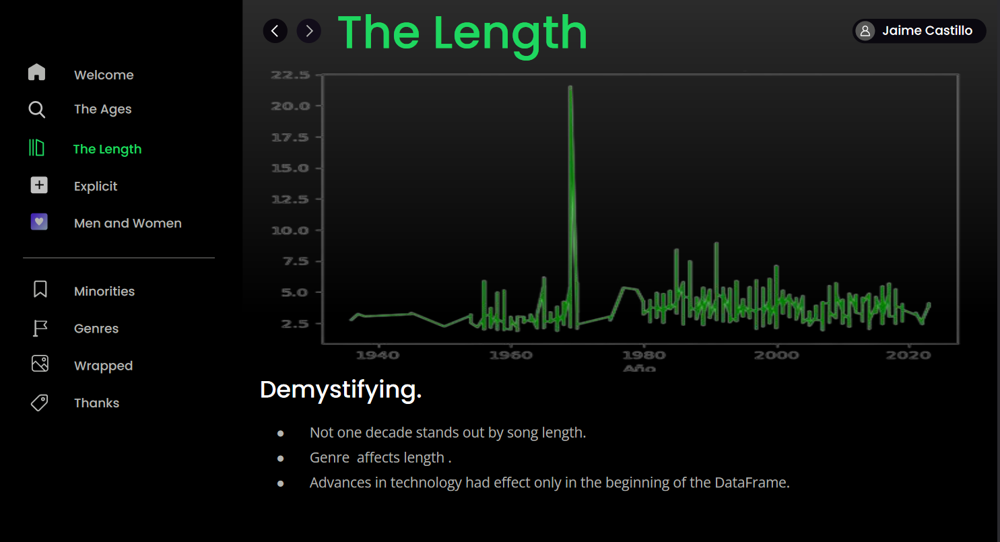
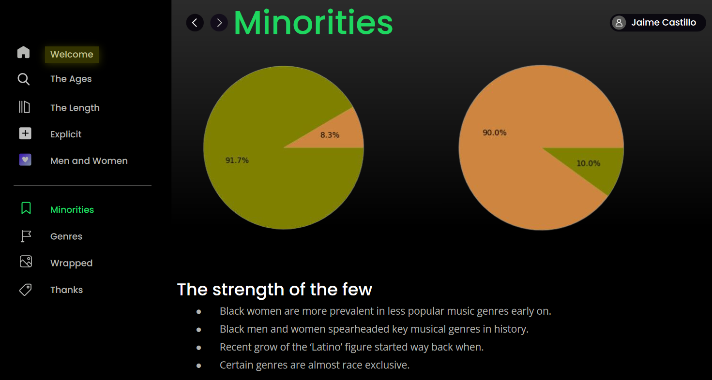
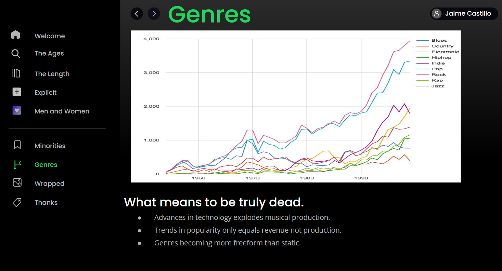
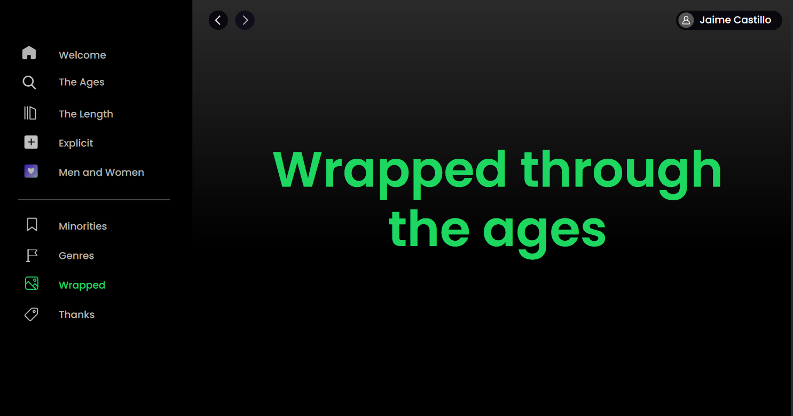
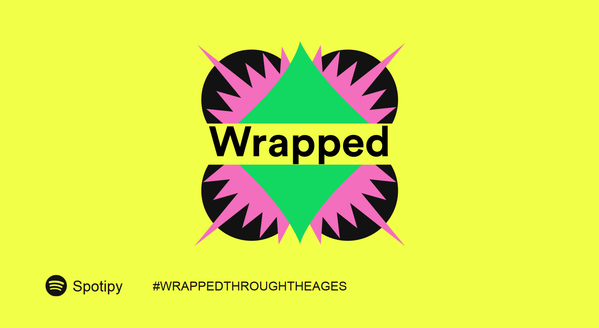

# Rise-and-Fall-of-the-Genres
A quick glance at the rise and fall of several music genres throught the decades analizing spotify data, comparing how genres, duration and sex affect the various aspects of music.

As we move forward towards the presentation we introduce the data sets and how they were obtained, creditig the wonderful coders at the million song database and spotipy for their useful API-s

Then we present the decades that the study focuses on:

After that we dive into the conclusions of the extraction:
First the length of the song and wether it affects its success

Then how genre cursing first came into the picture and how it affected, apart from what is considered explicit or not.

Then how both men and woman evolved throught the decades and how minorities, mostly black people; both men and woman, affected the industry sphere.
![Slide_8(Slides/Slide_8.png)

This later slides represent how production truly skyrocketed and how a music genre never truly dies.

Then we wrap everything up.

And we credit the people that compiled the data for our extraction, thank you for attention on this brief project of mine

